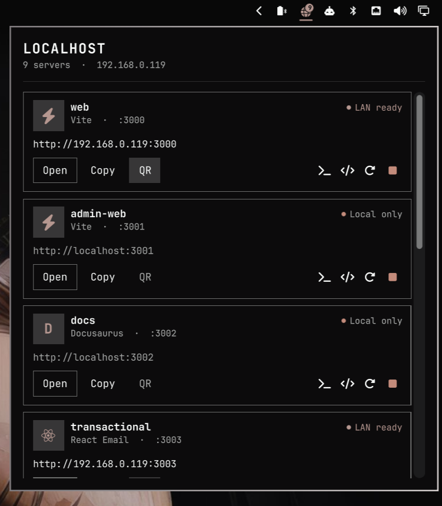
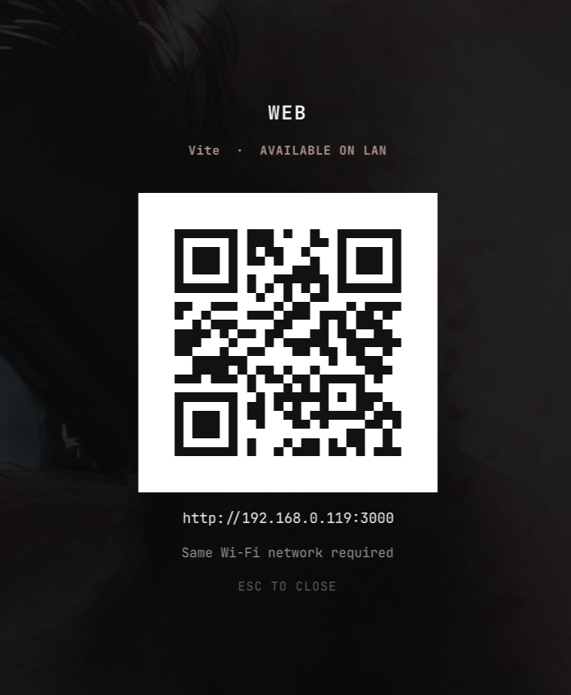

# Localhost for Omarchy

[](https://github.com/EmilsValdmanis/omarchy-localhost/actions/workflows/ci.yml)
[](LICENSE)

Your local development servers, one click away.

Start Vite, Next.js, Astro, Rails, or another development server and Localhost
automatically adds it to the Omarchy bar. Open it on your desktop, copy its
address, or put it on your phone with one scan.

> `pnpm dev` → Localhost appears → click **QR** → scan with your phone

## See it in action

| Discover and control servers | Share LAN-ready projects |
| :---: | :---: |
|  |  |
| See every detected project, distinguish LAN-ready servers from local-only ones, and open or manage them in place. | Turn a reachable server into a full-screen QR code that is easy to scan from a phone. |

## The good bit

Localhost understands the difference between a server that is merely running
and one your phone can actually reach.

- **Available on LAN** — the process listens on `0.0.0.0`, `::`, or a LAN
  interface. Localhost builds a URL with your default-route IP, such as
  `http://192.168.1.42:5173`, and enables QR sharing.
- **Local only** — the process listens on `127.0.0.1` or `::1`. Localhost keeps
  desktop actions available, disables QR, and explains how to bind the server
  for mobile testing.

The QR view is rendered as native QML rectangles, so it stays sharp at every
display scale and never needs a temporary image.

## MVP features

- Silent background discovery with a two-second default refresh
- Project and framework detection
- Localhost and LAN URLs
- Bind-address-aware LAN availability
- Full-screen, phone-ready QR overlay
- One-time, subnet-scoped UFW authorization for QR ports
- Open, copy, terminal, editor, restart, and stop actions
- A bar widget that appears only while servers exist
- Keyed list updates, so only new and removed servers animate
- Omarchy theme, spacing, typography, and popup primitives
- No daemon, database, account, or network service

## Install

Localhost targets the Quickshell-based Omarchy 4 / Quattro plugin API.

```bash
omarchy plugin add https://github.com/EmilsValdmanis/omarchy-localhost.git --enable
```

It lands in the right side of the bar by default. Move it anywhere with the
normal Omarchy bar controls; its popup stays anchored to the widget:

```bash
omarchy bar move emils.localhost --section left
omarchy bar move emils.localhost --section center
omarchy bar move emils.localhost --section right
```

Localhost uses QML/JavaScript plus `ss`, `ps`, `pwdx`, `ip`, `curl`, `wl-copy`,
`qrencode`, and—when UFW is active—`pkexec`. These are present in the intended Omarchy environment;
`qrencode` is the same tool used by Omarchy's built-in Wi-Fi QR panel.

## Use it from a phone

Most frameworks bind to localhost by default. Start yours on all interfaces:

```bash
# Vite / SvelteKit
pnpm dev -- --host 0.0.0.0

# Next.js
pnpm dev -- -H 0.0.0.0

# Astro
pnpm dev -- --host 0.0.0.0

# Python
python -m http.server 8000 --bind 0.0.0.0
```

Open Localhost from the bar, choose the server, and click **QR**. Your phone
must be on the same Wi-Fi/LAN. When UFW is active and the selected port is not
already allowed, Localhost asks for one Polkit authorization and adds an inbound
TCP rule limited to the active interface, current LAN subnet, and selected port.
That rule persists, so later QR scans for the same port need no authorization.
This behavior can be disabled in the widget settings.

## How discovery works

The QML service reads `ss -ltnp`, keeps only processes owned by the current
user, batches process metadata through `ps` and `pwdx`, and looks for common
development-server commands. It also reads published TCP ports from running
Docker and Compose containers, which do not expose an owning host PID. It then
briefly checks each candidate for a real HTTP response; API-style JSON 404/405
responses count because they still prove an HTTP service is listening.
Auxiliary Vite sockets, worker/control channels, databases, and other plain TCP
services are therefore left out. Process metadata and probe results stay cached
inside the long-running shell.

Nothing is transmitted anywhere. The LAN address comes from the source address
of the machine's default route; determining it does not contact `1.1.1.1`.

Restart recovers the listening process's command, working directory, and
environment from `/proc` before sending `SIGTERM`, then launches it in a new
session. Output from a restarted process goes to
`~/.local/state/omarchy/localhost/`.

## Develop locally

```bash
node --test tests/test_radar_model.mjs
omarchy plugin validate .
qmllint -I /usr/share/omarchy/shell \
  RadarService.qml ServerPanel.qml Widget.qml QrOverlay.qml
```

Install a local checkout after committing it:

```bash
omarchy plugin add "file://$PWD" --enable --yes
```

Plugin changes hot-reload from `~/.config/omarchy/plugins/emils.localhost/`.

## License

MIT

Contributions are welcome. See [CONTRIBUTING.md](CONTRIBUTING.md) for the
development workflow and [SECURITY.md](SECURITY.md) for responsible security
reporting.
