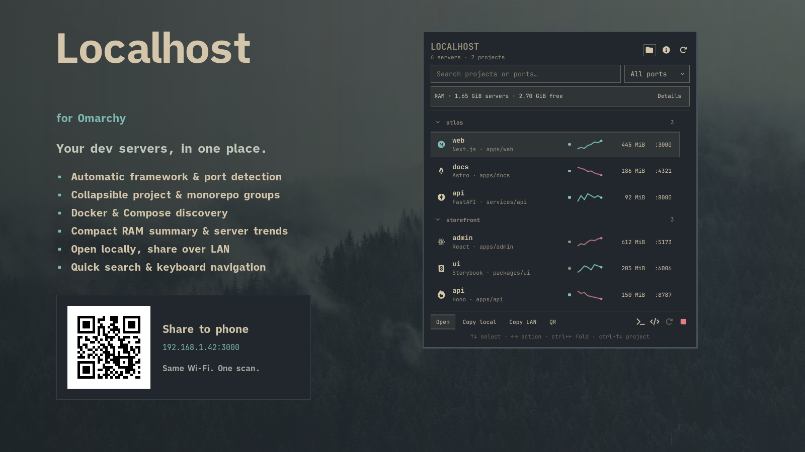

# Localhost for Omarchy

[](manifest.json)
[](LICENSE)

Discover, control, and share local development servers from the Omarchy bar.
Start Vite, Next.js, Astro, Rails, or another server and Localhost adds it
automatically.

See [GitHub Releases](https://github.com/EmilsValdmanis/omarchy-localhost/releases)
for version history and release notes.

> `pnpm dev` → Localhost appears → click **QR** → scan with your phone



## Features

- Automatic process, framework, Docker, and Compose discovery
- Repository and monorepo grouping with package-aware framework detection
- Localhost and LAN URLs with bind-address-aware availability
- Open, copy, QR, terminal, editor, restart, and stop actions
- Search and complete arrow-key or Vim-style navigation
- Phone-ready QR sharing with optional subnet-scoped UFW rules
- Discovery diagnostics, port filters, and LAN-rule management
- Process identity verification before stop or restart
- Native Omarchy styling with no daemon, database, or account

Servers in the same repository or workspace appear together, with package paths
under each name. Use the folder button to switch to a flat list sorted by port.
Select a row to use its shared action toolbar, or click its port to open it.

LAN-ready servers listen on `0.0.0.0`, `::`, or a LAN interface. Servers bound
to `127.0.0.1` or `::1` remain available for desktop actions, but QR sharing is
disabled until they are exposed to the local network.

## Install

Localhost targets the Quickshell-based Omarchy 4 / Quattro plugin API.

```bash
omarchy plugin add https://github.com/EmilsValdmanis/omarchy-localhost.git --enable
```

It appears on the right side of the bar by default. Move it with:

```bash
omarchy bar move emils.localhost --section left   # or center / right
```

The intended Omarchy environment already provides the required system tools:
Python 3.11+, `ss`, `ip`, `curl`, `wl-copy`, and `qrencode`. Docker discovery is
optional and only runs when Docker is available.

## Keyboard

| Key                                  | Action                                                 |
| ------------------------------------ | ------------------------------------------------------ |
| `/` or click search                  | Search by project, framework, port, path, or container |
| `up/down`, `j/k`, `ctrl+p/ctrl+n`    | Select a server                                        |
| `left/right`, `h/l`                  | Select an action in the footer                         |
| `enter`                              | Run the selected action                                |
| `ctrl+c`                             | Copy the selected URL                                  |
| `ctrl+r`                             | Refresh discovery                                      |
| `alt+r`                              | Restart the selected server                            |
| `delete`, or `ctrl+k` with no filter | Confirm stopping the selected server                   |
| `esc`                                | Leave search, clear the filter, then close             |

### Optional global shortcut

`SUPER + SHIFT + L` is unassigned in the stock Omarchy 4 keybindings. To use
it to toggle Localhost, add this to `~/.config/hypr/bindings.lua`:

```lua
o.bind("SUPER + SHIFT + L", "Localhost", "omarchy-shell emils.localhost toggle")
```

## Use it from a phone

Bind the development server to all interfaces:

```bash
pnpm dev -- --host 0.0.0.0       # Vite, SvelteKit, Astro
pnpm dev -- -H 0.0.0.0           # Next.js
python -m http.server 8000 --bind 0.0.0.0
```

Open Localhost and choose **QR**. Your phone must be on the same Wi-Fi or LAN.
If UFW blocks the port, Localhost can add a persistent inbound TCP rule limited
to the active interface, current subnet, and selected port. Rules created by
Localhost can be removed from the shield menu.

## Settings

| Setting              | Purpose                                         |
| -------------------- | ----------------------------------------------- |
| Refresh interval     | Scan every 1–30 seconds                         |
| Show server count    | Toggle the bar badge                            |
| Show when empty      | Keep the widget available with no servers       |
| Include Docker       | Discover browser-ready Docker and Compose ports |
| Ignored ports        | Hide ports or ranges such as `3001,8000-8010`   |
| Always include ports | Probe unusual or unrecognized servers           |
| Authorize LAN access | Offer scoped UFW access before QR sharing       |

## How it works

Localhost reads listening sockets from `ss`, batches process metadata through a
small Python helper, and probes likely development servers over HTTP and HTTPS.
It filters helper sockets, databases, and other non-browser services. Published
Docker ports are discovered separately because they do not expose a host PID.

Every eligible listening port is checked, including multiple HTTP servers in
one process and fallback ports chosen when a default is busy. Framework labels
use executable arguments and dependencies from the nearest `package.json` or
`pyproject.toml`. Project metadata is read once per discovery batch without
executing project code or searching directory trees.

Grouping uses the nearest Git repository, including worktrees and nested
repositories. Outside Git, it recognizes pnpm, npm/Yarn workspaces, Lerna,
Cargo workspaces, and `go.work`. Native processes and Compose services share a
group when their working directories resolve to the same project root.

Nothing is sent elsewhere. Before stopping or restarting a process, the helper
verifies its owner and Linux start time so a reused PID cannot target the wrong
process. See [SECURITY.md](SECURITY.md) for security reporting.

## Remove

Remove Localhost-created firewall rules from the shield menu first, then run:

```bash
omarchy plugin remove emils.localhost
```

If the plugin is already gone, inspect `sudo ufw status numbered` for rules
commented `omarchy-localhost` and remove the matching rule numbers.

## Development

Run the development watcher from the repository root:

```bash
./dev
```

It validates the plugin, creates a guarded development install at
`~/.config/omarchy/plugins/emils.localhost`, enables it when necessary, and
syncs every saved change into that directory. Omarchy then hot-reloads the
plugin automatically, so QML changes appear immediately. Press `ctrl+c` to
stop watching. The development install remains available for the next run;
remove it with `omarchy plugin remove emils.localhost` when it is no longer
needed.

`./dev` will not overwrite a normal Git-installed copy. Remove that copy first
if you want to replace it with the development install.

Run the checks before opening a pull request:

```bash
./check
```

This runs model/helper tests, plugin validation, Qt 6 lint, and real Quickshell
UI tests, including native wheel input, model changes while scrolled, keyboard
actions, grouping, QR rendering, and two HTTP listeners in one disposable
process. It also checks the hidden
Wayland entry points when a compositor is available. Screenshots and logs are
saved to `/tmp/localhost-test-artifacts`; your installed plugin is untouched.

See [CONTRIBUTING.md](CONTRIBUTING.md) for the development workflow and CI setup.

## License

[MIT](LICENSE)
